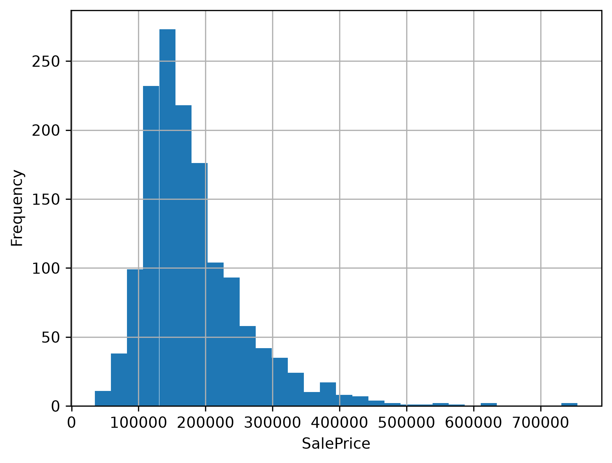
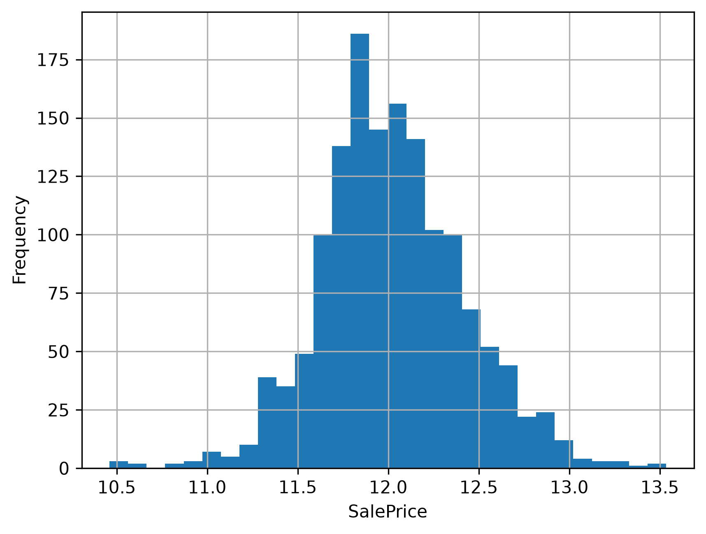
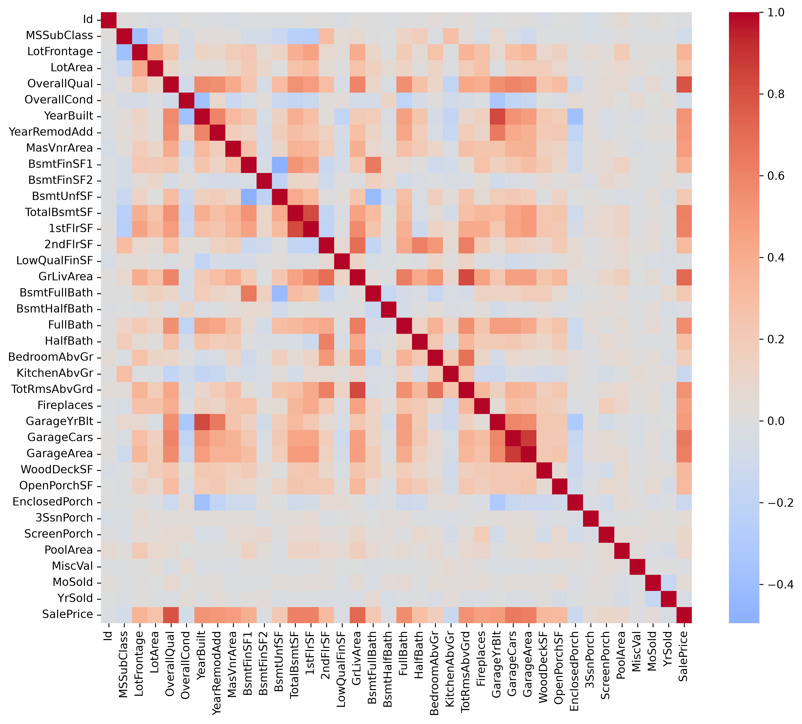
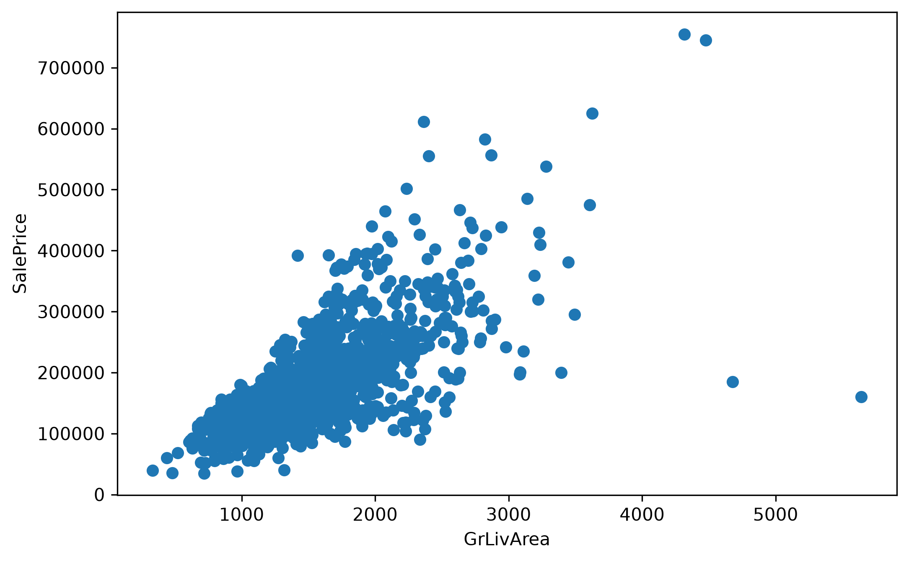
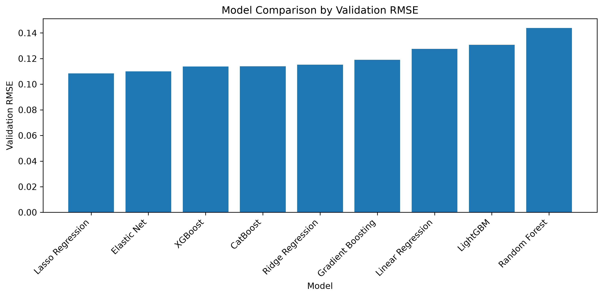

# House Price Prediction

A machine learning project for the [Kaggle House Prices: Advanced Regression Techniques](https://www.kaggle.com/competitions/house-prices-advanced-regression-techniques) competition.

**Kaggle Score: 0.12902 RMSLE**

## Project Structure

```
house-price-prediction/
├── data/
│   ├── train.csv
│   ├── test.csv
│   └── submission.csv
├── images/
│   ├── saleprice_distribution.png
│   ├── saleprice_log_distribution.png
│   ├── correlation_matrix.png
│   ├── grliv_vs_saleprice.png
│   └── model_comparison.png
├── notebooks/
│   └── exploration.ipynb
├── src/
│   ├── preprocessing.py
│   ├── train.py
│   ├── evaluate.py
│   └── predict.py
├── requirements.txt
└── README.md
```
## Workflow

1. **EDA** — Explored distributions, correlations, and outliers
2. **Feature Engineering** — Created TotalSF, HouseAge, RemodelAge, TotalBathrooms, binary indicators, log-transformed skewed features and target
3. **Preprocessing Pipeline** — Median imputation + StandardScaler for numerical, OrdinalEncoder for ordinal categorical, OneHotEncoder for nominal categorical
4. **Model Comparison** — Trained and evaluated 9 models with train/validation split
5. **Hyperparameter Tuning** — RandomizedSearchCV followed by GridSearchCV on top 4 models
6. **Final Model** — Lasso Regression retrained on full training data

## Results

### SalePrice Distribution

The target variable is right-skewed. A log transformation was applied to normalize the distribution.




### Feature Correlation

OverallQual, GrLivArea, GarageCars, and TotalBsmtSF show the strongest correlations with SalePrice.



### GrLivArea vs SalePrice

Clear positive linear relationship. Two outliers (large area, low price) were removed during preprocessing.



### Model Comparison

9 models were evaluated using a validation split. Lasso Regression achieved the lowest Validation RMSE.



| Model | Validation RMSE |
|---|---|
| Lasso Regression | 0.1084 |
| Elastic Net | 0.1100 |
| XGBoost | 0.1138 |
| CatBoost | 0.1140 |
| Ridge Regression | 0.1152 |
| Gradient Boosting | 0.1191 |
| Linear Regression | 0.1276 |
| LightGBM | 0.1308 |
| Random Forest | 0.1439 |

### Hyperparameter Tuning (CV RMSE)

| Model | Mean CV RMSE |
|---|---|
| Lasso Regression | 0.11252 |
| Elastic Net | 0.11361 |
| CatBoost | 0.11607 |
| XGBoost | 0.11869 |

### Kaggle Submission

Final model: Lasso Regression with tuned alpha ≈ 0.000600

**Public Score: 0.12902**

## Setup

```bash
# Clone the repo
git clone https://github.com/mustafa-al-soufi/house-price-prediction.git
cd house-price-prediction

# Create virtual environment
python -m venv .venv
source .venv/Scripts/activate  # Windows
# source .venv/bin/activate    # Mac/Linux

# Install dependencies
pip install -r requirements.txt
```

## Run

```bash
python src/predict.py
```

Generates `data/submission.csv` ready for Kaggle submission.